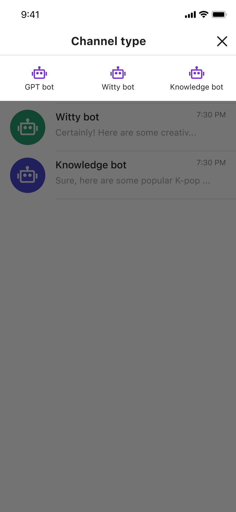
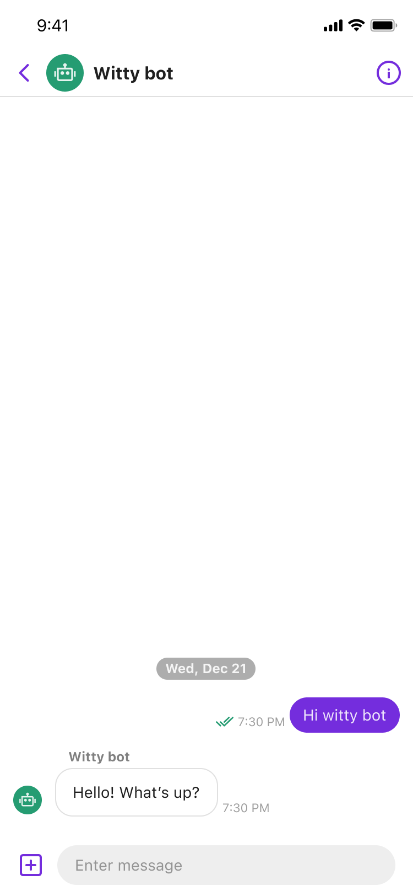

# Sendbird ChatGPT Sample for iOS

This is an example of [Sendbird ChatGPT](https://sendbird.com/docs/chat/v3/platform-api/bot/bot-overview#1-overview) for iOS, implemented using [Sendbird UIKit](https://sendbird.com/docs/uikit/v3/ios/overview).

<p>
Sendbird ChatGPT: Sendbird ChatGPT is a Sendbird Chat integration into your existing ChatGPT bot can provide customers with a more engaging and personalized conversation experience.
</p>

<p align="center">
  
  
</p>

## Getting Started
1. Create your Sendbird application on [the dashboard](https://dashboard.sendbird.com/auth/signup).
2. [Register the ChatGPT bot](https://sendbird.com/developer/tutorials/chatbot-google-dialogflow) in your Sendbird application.
3. In this example, we're connecting to a test purpose Sendbird application and pre-defined bots. To connect yours, replace `applicationId` and others in the `AppDelegate.swift` file and replace `ChatBot` in the `ChatBot.swift` file as follows: 

```swift
// AppDelegate.swift
@main
class AppDelegate: UIResponder, UIApplicationDelegate {

    var window: UIWindow?

    func application(_ application: UIApplication, didFinishLaunchingWithOptions launchOptions: [UIApplication.LaunchOptionsKey: Any]?) -> Bool {
        // Override point for customization after application launch.
        
        // TODO: Replace with your own APP_ID
        SendbirdUI.initialize(applicationId: "13B6D179-33A5-4C0D-9162-E11DAC9358FC") { error in
            //
        }
        
        SBUGlobals.currentUser = SBUUser(userId: "j_sung_0o0")
        
        // ...
    }
    
    // ...
}
```

```swift
// ChatBot.swift
enum ChatBot: Int, CaseIterable {
    // TODO: Replace with your own user IDs of bots
    case chatGPT
    
    var botID: String {
        switch self {
        case .chatGPT: return "gpt_bot"
    }
}
```

4. Build & Run

## How to connect a channel to a bot
This sample supports chat with 3 different bots. They are trained with 3 different characteristics.
Currently, Only 1:1 chat with ChatGPT bot is supoorted.When you create a channel, you just need to enter the user ID of the bot you want to chat with.

```swift
createChannelViewModel?.createChannel(userIds: [ChatBot.chatGPT.botID])
```

For more information, see [our documentation](https://sendbird.com/docs/chat/v3/platform-api/bot/bot-overview#1-overview).

## Implementation

### Bot type selector

```swift
// 1
class BotTypeSelector: SBUCreateChannelTypeSelector {
    // 3
    weak var botSelectorDelegate: BotTypeSelectorDelegate?

    // 4
    @objc
    func onTapChatGPTBot() {
        self.botSelectorDelegate?.botTypeSelector(self, didSelectBot: .chatGPT)
    }
}

// 2
protocol BotTypeSelectorDelegate: AnyObject {
    func botTypeSelector(_ botTypeSelect: BotTypeSelector, didSelectBot bot: ChatBot)
}
```
1. Override `SBUCreateChannelTypeSelector` to use the same design.
2. Define protocol called `BotTypeSelectorDelegate` as an event delegate
3. Declare delegate property as a weak reference.
4. Call `botTypeSelector(_:didSelectBot:)` delegate method when the bot button selected.

### Channel list - SBUCreateChannelViewModel
```swift
class ChatGPTChannelListViewController: SBUGroupChannelListViewController, SBUCreateChannelViewModelDelegate {
    var createChannelViewModel: SBUCreateChannelViewModel?

    // 1
    override func createViewModel(channelListQuery: GroupChannelListQuery?) {
        super.createViewModel(channelListQuery: channelListQuery)
        self.createChannelViewModel = SBUCreateChannelViewModel(delegate: self)
    }

    // 2
    func createChannelViewModel(_ viewModel: SBUCreateChannelViewModel, didCreateChannel channel: BaseChannel?, withMessageListParams messageListParams: MessageListParams?) {
        guard let channelURL = channel?.channelURL else { return }
        SendbirdUI.moveToChannel(channelURL: channelURL, messageListParams: messageListParams)
    }
}
```
1. Create `SBUCreateChannelViewModel` instance after `super.createViewModel(channelListQuery:)` is called.
2. When `didCreateChannel` is called, call `SendbirdUI.moveToChannel(channelURL:messageListParams:)`

### Channel list - BotTypeSelector

```swift
extension ChatGPTChannelListViewController: BotTypeSelectorDelegate {
    // 1
    override func loadChannelTypeSelector() {
        if self.createChannelTypeSelector == nil {
            let botTypeSelector = BotTypeSelector(delegate: self)
            botTypeSelector.botSelectorDelegate = self
            botTypeSelector.isHidden = true
            self.createChannelTypeSelector = botTypeSelector
        }
        
        guard let createChannelTypeSelector else { return }
        self.navigationController?.view.addSubview(createChannelTypeSelector)
    }

    // 2
    override func baseChannelListModule(_ headerComponent: SBUBaseChannelListModule.Header, didTapRightItem rightItem: UIBarButtonItem) {
        self.showCreateChannelTypeSelector()
    }

    // 3
    func botTypeSelector(_ botTypeSelect: BotTypeSelector, didSelectBot bot: ChatBot) {
        botTypeSelect.dismiss()
        createChannelViewModel?.createChannel(userIds: [bot.botID])
    }
}
```
1. Override `loadChannelTypeSelector` to use `BotTypeSelector`.
2. Override `didTapRightItem` delegate method to call `showCreateChannelTypeSelector()`. This will show `BotTypeSelector`.
3. When bot type is selected from `BotTypeSelector`, `botTypeSelector(_:didSelectBot:)` delegate method is called. In the method, call `SBUCreateChannelViewModel/createChannel(userIds:)`.
